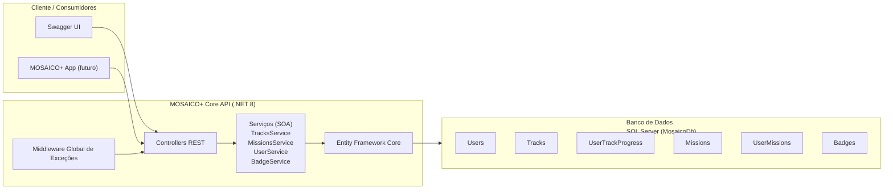
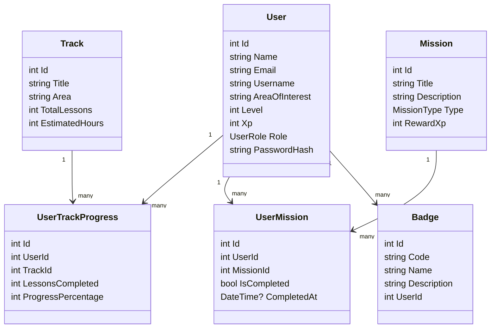
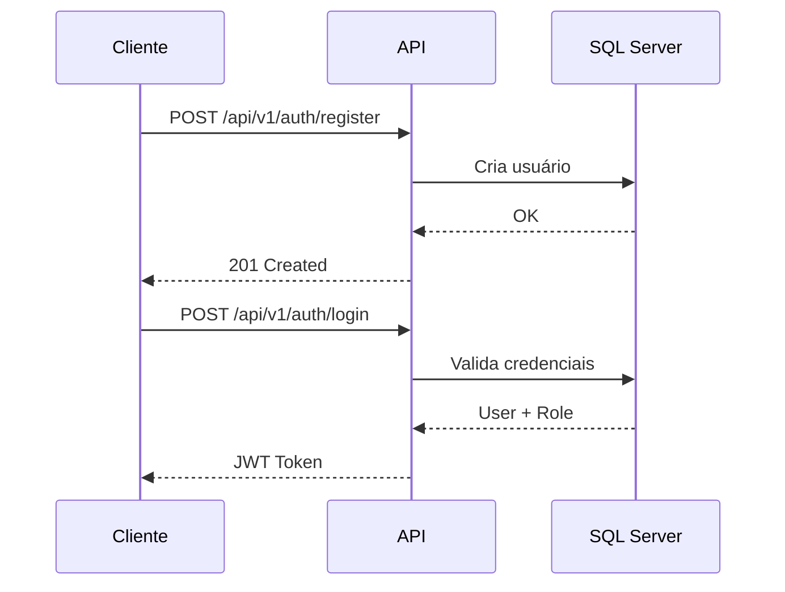

# MOSAICO+ Core API (.NET 8)

API RESTful para o projeto **Global Solution – O Futuro do Trabalho (FIAP)**
Disciplinas: **C#** e **SOA & WebServices**

---

## 📘 Visão Geral

A **MOSAICO+ Core API** é o backend oficial da plataforma **MOSAICO+**, um ecossistema digital gamificado que conecta trilhas de aprendizagem, missões, badges e evolução profissional de usuários.

A API foi construída com foco em:

* Arquitetura **SOA** (Services Oriented Architecture)
* **Boas práticas REST**
* **Segurança com JWT + Autorização por Perfis (Roles)**
* **Tratamento global de exceções**
* **DTOs, Entities, Enums e Controllers bem definidos**
* **Versionamento via `/api/v1/...`**
* **Swagger com autenticação pelo botão Authorize()**

---

## 🧩 Objetivo do Projeto

Criar uma API robusta, segura e modular, que permita:

* Registrar usuários com diferentes perfis (**Student**, **Company**, **Admin**)
* Manipular trilhas de estudo
* Atribuir e completar missões
* Conceder e revogar badges
* Gerenciar progresso do usuário
* Permitir que cada funcionalidade seja exposta como **serviço independente** (SOA)

---

# 🏛 Arquitetura (SOA + Clean Services)

A seguir os diagramas completos, prontos para visualização no GitHub.

---

## 🗺️ Diagrama 1 – Arquitetura Geral (SOA)



---

## 📦 Diagrama 2 – Modelo de Domínio (Entidades)



---

## 🔁 Diagrama 3 – Fluxo de Autenticação / JWT



---

## 🧱 Tecnologias

* **.NET 8 (C#)**
* **Entity Framework Core**
* **SQL Server**
* **JWT Bearer Authentication**
* **Swagger / OpenAPI**
* **SOA com Services + Interfaces**
* **Middleware customizado**
* **Migrations com EF Core**

---

# ✔ Atendimentos aos Requisitos — C# (100%)

### ✔ Boas práticas REST

* Verbos corretos (GET, POST, PUT, DELETE)
* Rota padrão `/api/v1/[controller]`
* Respostas com `ActionResult`, `CreatedAtAction`, `NoContent`, `NotFound`, etc.

### ✔ Versionamento da API

* Todas as rotas seguem padrão:

  ```  /api/v1/...
  ```

### ✔ Integração com Banco de Dados

* SQL Server
* Entity Framework Core
* Migrations aplicadas (`InitialCreate`, `AddAuthFields...`)

### ✔ Documentação com Swagger

* JWT integrado
* Botão **Authorize**
* Modelos e responses automáticos

---

# ✔ Atendimentos aos Requisitos — SOA & WebServices (100%)

### ✔ Entities, DTOs, Enums e Controllers criados

* DTOs: `UserDto`, `TrackDto`, `MissionDto`, `BadgeDto`
* Enums: `UserRole`, `MissionType`
* Controllers: Users, Tracks, Missions, Badges, Auth
* Exceto Auth, todos versionados e organizados

---

### ✔ Padronização de Resposta com ResponseEntity

Via `ActionResult`, `CreatedAtAction`, `NoContent`, `Ok`, `BadRequest`

---

### ✔ Tratamento Global de Exceções (Middleware)

`ExceptionHandlingMiddleware` intercepta exceções e retorna JSON:

* 400 para erros de validação
* 404 quando entidade não existe
* 500 para erros internos

---

### ✔ Segurança para Autenticação de Usuário

* Registro + Login via JWT
* Hash de senha com BCrypt

---

### ✔ Autorização com Roles

* Perfis: **Admin**, **Student**, **Company**
* Exemplo:

```csharp
[Authorize(Roles = "Admin")]
```

---

### ✔ Política Stateless com Token JWT

* API usa `JwtBearer`
* Sem session
* Stateless total (SOA compliant)

---

### ✔ Regras de Negócio em Services (SOA)

Dividido em:

* `ITrackService` / `TrackService`
* `IMissionService` / `MissionService`
* `IUserService` / `UserService`
* `IBadgeService` / `BadgeService`

Controllers ficaram finos, delegando trabalho aos serviços.

---

### ✔ Organização Modular

* Camadas independentes:

  * `/Application/Interfaces`
  * `/Application/Services`
  * `/Domain/Entities`
  * `/Dtos`
  * `/Controllers`
  * `/Infrastructure/Data`

---

# 📡 Endpoints Principais (v1)

### 🔐 Auth

`POST /api/v1/auth/register`
`POST /api/v1/auth/login`

---

### 👤 Users (Admin only)

`GET /api/v1/users`
`GET /api/v1/users/{id}`
`PUT /api/v1/users/{id}`
`DELETE /api/v1/users/{id}`

---

### 📚 Tracks

`GET /api/v1/tracks`
`POST /api/v1/tracks` (Admin)
`PUT /api/v1/tracks/{id}` (Admin)
`DELETE /api/v1/tracks/{id}` (Admin)

---

### 🎯 Missions

`GET /api/v1/missions`
`POST /api/v1/missions` (Admin)
`PUT /api/v1/missions/{id}` (Admin)
`DELETE /api/v1/missions/{id}` (Admin)

---

### 🏅 Badges

`GET /api/v1/users/{userId}/badges`
`POST /api/v1/users/{userId}/badges` (Admin)
`DELETE /api/v1/users/{userId}/badges/{badgeId}` (Admin)

---

# ▶️ Como executar

```bash
dotnet restore
dotnet ef database update
dotnet run
```

Acesse:

```
https://localhost:xxxx/swagger
```

Clique no botão **Authorize**, cole o token JWT e use normalmente.

---

# 👤 Integrantes do Grupo

* **Nikolas Rodrigues Moura dos Santos – RM 551566**
* **Thiago Jardim de Oliveira – RM 551624**
* **Rodrigo Brasileiro – RM 98952**

---

# 🚀 Conclusão

A MOSAICO+ Core API foi construída com rigor técnico para atender aos requisitos de:

* **C# (REST, DB, Swagger, arquitetura limpa)**
* **SOA (serviços independentes, JWT stateless, modularidade, exceções globais)**
* **Futuro do Trabalho (tema da Global Solution)**

É uma base sólida, escalável e profissional, pronta para integração com o app mobile e evolução futura.
