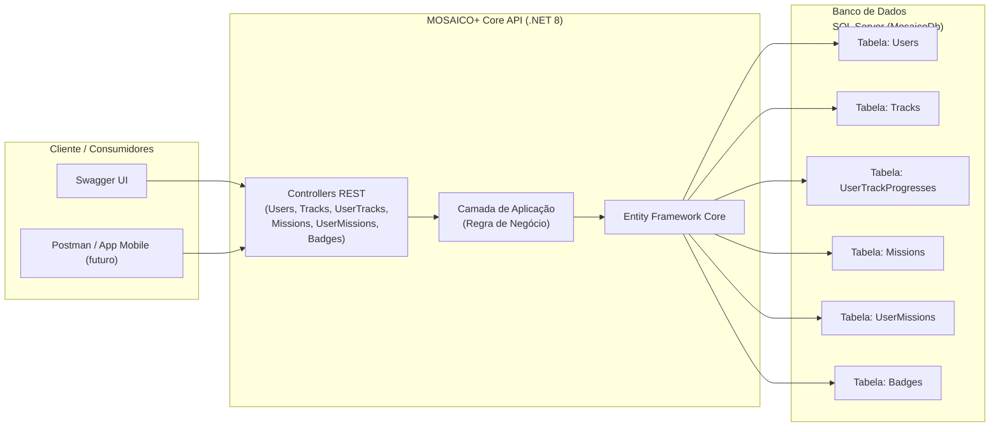
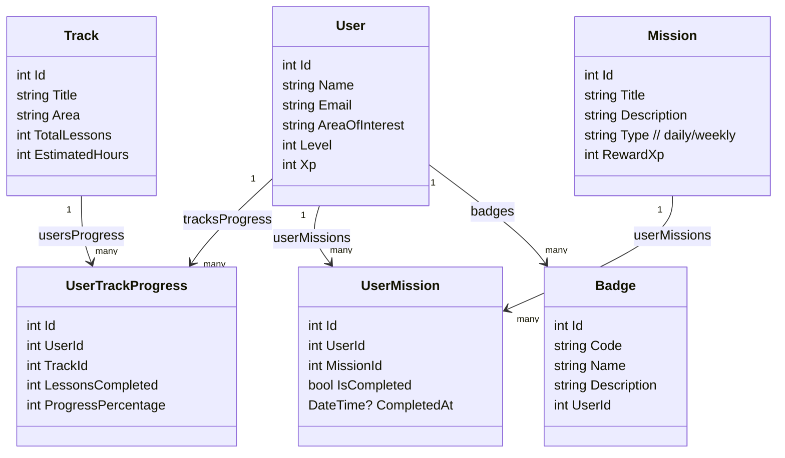
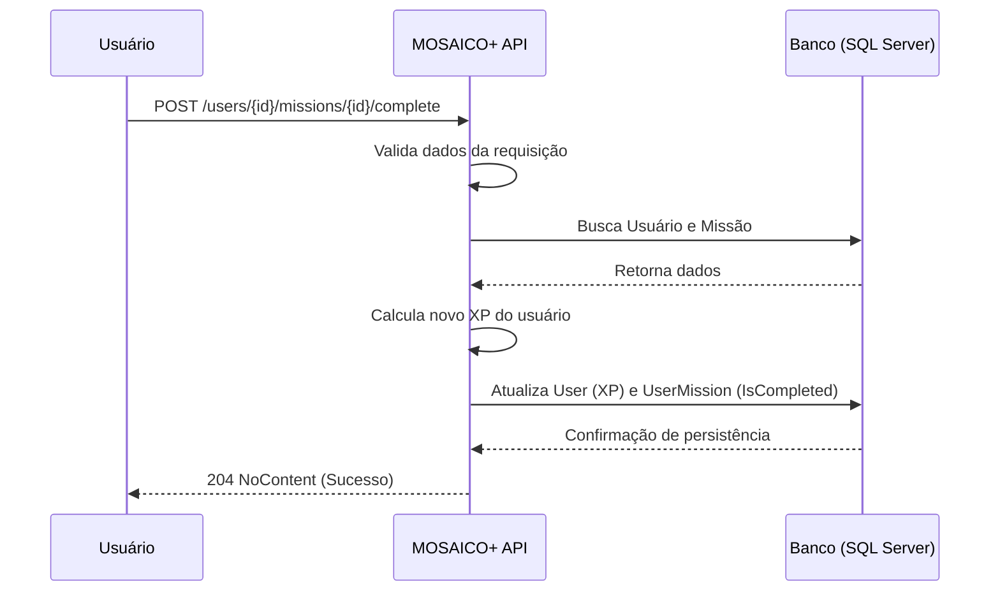

# MOSAICO+ Core API (.NET 8)

API RESTful desenvolvida em C# / .NET para o projeto **Global Solution – O Futuro do Trabalho (FIAP)**.

A **MOSAICO+ Core API** representa o núcleo backend de uma plataforma gamificada de trilhas de aprendizagem, missões e badges, onde usuários podem evoluir suas habilidades de forma contínua e rastreável.

---

## 🎯 Objetivo

Demonstrar uma solução tecnológica alinhada ao tema **“O Futuro do Trabalho”**, aplicando:

- Boas práticas REST (verbo correto + status code adequado);
- Versionamento da API por URL (`/api/v1/...`);
- Integração com banco de dados via **Entity Framework Core + SQL Server**;
- Documentação via **Swagger / OpenAPI**;
- Estrutura arquitetural clara para avaliação acadêmica.

---

## 📐 Arquitetura da Solução

A API segue uma arquitetura limpa baseada em três camadas principais:

*   **Controllers REST:** Responsáveis por receber as requisições HTTP, validar a entrada e orquestrar as operações.
*   **Camada de Aplicação:** Onde residem as regras de negócio simples e a lógica de coordenação.
*   **Acesso a Dados:** Abstraído pelo **Entity Framework Core**, que se comunica com um banco de dados **SQL Server**.

Os diagramas abaixo ilustram a estrutura e o fluxo dos componentes.

### 🗺️ 1 — Arquitetura Geral

Este diagrama mostra a visão macro da solução, desde o cliente até a persistência dos dados.



### 🏛️ 2 — Modelo de Domínio (Entidades)

O diagrama abaixo representa as principais entidades do sistema e seus relacionamentos.



### 🔁 3 — Fluxo de Gamificação

Este diagrama de sequência ilustra um fluxo de uso comum na plataforma, mostrando como a gamificação funciona.



---

## 🔗 Versionamento da API

A API utiliza **versionamento por URL**. Todas as rotas desta versão seguem o prefixo `api/v1`.

-   **Exemplo:** `GET /api/v1/users`

Essa estratégia permite evoluir a API no futuro (`/api/v2/...`) sem quebrar integrações existentes.

---

## 🧱 Principais Recursos (Endpoints v1)

A seguir, a lista dos principais endpoints disponíveis.

### 👤 Users
- `GET /api/v1/users`
- `GET /api/v1/users/{id}`
- `POST /api/v1/users`
- `PUT /api/v1/users/{id}`
- `DELETE /api/v1/users/{id}`

### 📚 Tracks
- `GET /api/v1/tracks`
- `GET /api/v1/tracks/{id}`
- `POST /api/v1/tracks`
- `PUT /api/v1/tracks/{id}`
- `DELETE /api/v1/tracks/{id}`

### 📈 User Tracks (Progresso)
- `GET /api/v1/users/{userId}/tracks`
- `POST /api/v1/users/{userId}/tracks/{trackId}/progress`

### 🎯 Missions & User Missions
- `GET /api/v1/missions`
- `POST /api/v1/missions`
- `GET /api/v1/users/{userId}/missions`
- `POST /api/v1/users/{userId}/missions/{missionId}/complete`

### 🏅 Badges
- `GET /api/v1/users/{userId}/badges`
- `POST /api/v1/users/{userId}/badges`

---

## 🗄️ Banco de Dados & Entity Framework Core

-   **Banco:** SQL Server (LocalDB ou Express)
-   **ORM:** Entity Framework Core
-   **Estratégia:** Code-First com Migrations

Para criar ou atualizar a estrutura do banco de dados, utilize os comandos do EF Core. A migration inicial (`InitialCreate`) já está incluída no projeto.

---

## 📚 Documentação da API (Swagger)

A documentação interativa está disponível via **Swagger UI**. Ao executar o projeto, acesse:

```text
https://localhost:xxxx/swagger
```
*(A porta `xxxx` será definida ao iniciar a aplicação).*

Pelo Swagger é possível inspecionar todos os endpoints, testar requisições e validar os status codes de resposta.

---

## ▶️ Como executar localmente

Siga os passos abaixo para rodar a API em sua máquina.

**1. Restaurar dependências:**
```bash
dotnet restore
```

**2. Aplicar as migrations no banco de dados:**
```bash
dotnet ef database update
```

**3. Executar a API:**
```bash
dotnet run
```

**4. Acessar o Swagger** no endereço fornecido pelo console.

---

## 🎥 Vídeo de Demonstração

O vídeo de apresentação do projeto demonstra a arquitetura, o uso dos endpoints via Swagger e a persistência dos dados no banco.

**Link do vídeo:** *[LINK DO YOUTUBE]*

---

## 👤 Autores

* Nikolas Rodrigues Moura dos Santos  – RM: 551566
* Thiago Jardim de Oliveira - RM: 551624
* Rodrigo Brasileiro - RM: 98952
